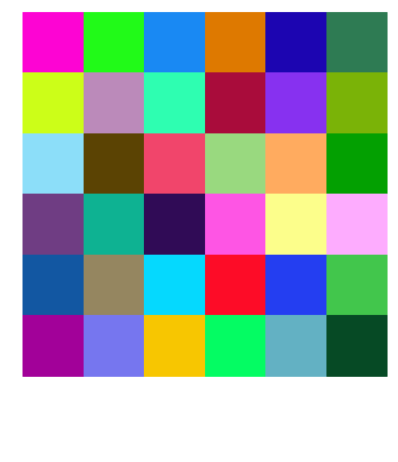

# distinctipy

*distinctipy* is a lightweight python package providing functions to generate
colours that are visually distinct from one another.

Commonly available qualitative colormaps provided by the likes of matplotlib
generally have no more than 20 colours, but for some applications it is useful
to have many more colours that are clearly different from one another.
*distinctipy* can generate lists of colours of any length, with each new colour
added to the list being as visually distinct from the pre-existing colours in
 the list as possible.

 

## Installation

*distinctipy* is designed for Python 3 and can be installed with pip by running:
```
pip3 install distinctipy
```

## Usage and Examples

To create and then display N = 36 visually distinct colours:

```python
import distinctipy

# number of colours to generate
N = 36

# generate N visually distinct colours
colors = distinctipy.get_colors(N)

# display the colours
distinctipy.color_swatch(colors)
```

More detailed example usage can be found in the notebook [examples.ipynb](examples.ipynb).

## References

*distinctipy* was heavily influenced and inspired by several web sources and
stack overflow answers. In particular:
* **Random generation of distinct colours:** [Andrew Dewes on GitHub](https://gist.github.com/adewes/5884820)
* **Colour distance metric:** [Thiadmer Riemersma at CompuPhase](https://www.compuphase.com/cmetric.htm)
* **Best text colour for background:** [Mark Ransom on Stack Overflow](https://stackoverflow.com/a/3943023)

Thanks!
